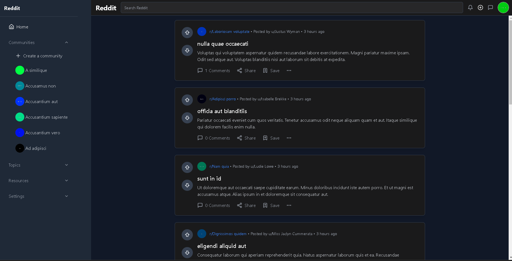
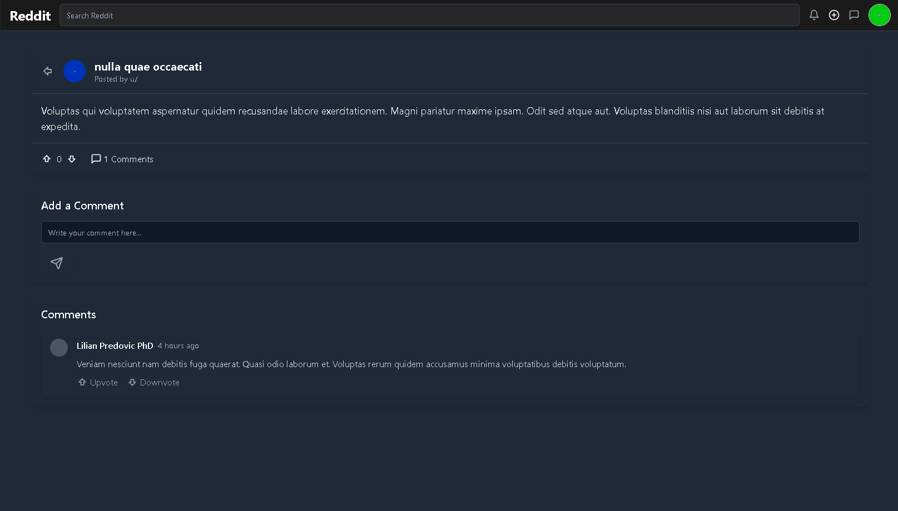
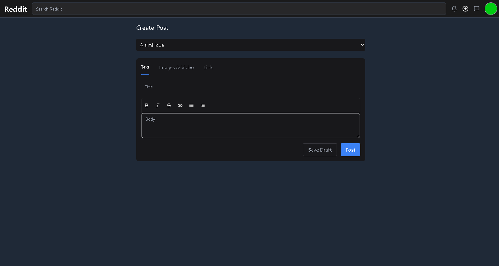
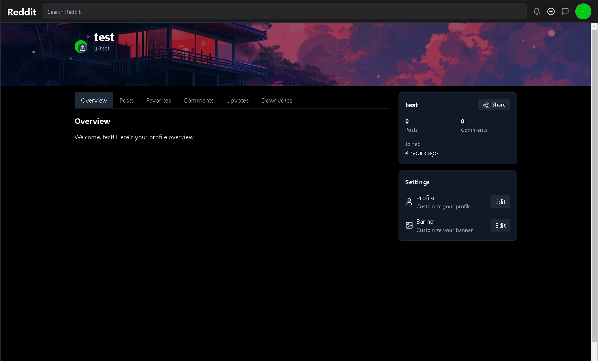
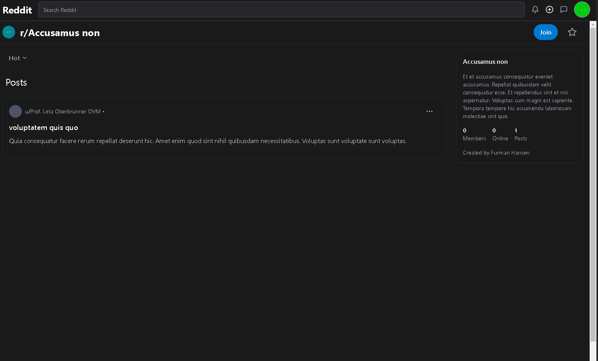
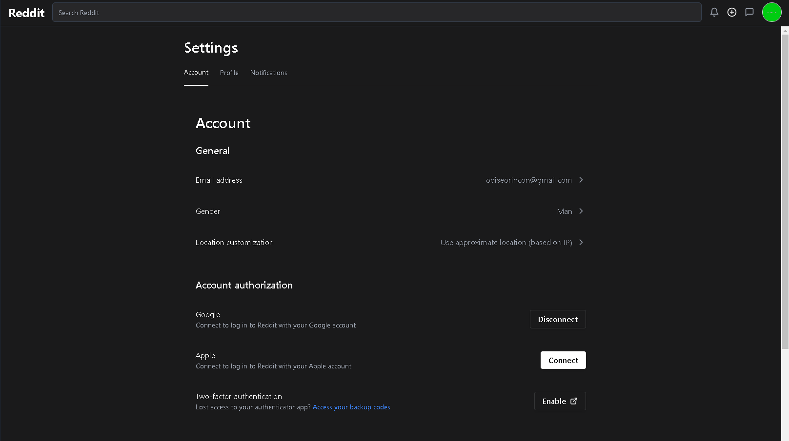

### README Mejorado y Dividido en Secciones

# Reddit Clone

Este proyecto es un clon básico de Reddit, desarrollado con **Laravel** como backend y **React** como frontend. El objetivo es replicar las funcionalidades más esenciales de la plataforma.

---

## Frontend

El frontend de la aplicación maneja la interacción del usuario, permitiendo navegar entre publicaciones, perfiles y comunidades.

### Home
La página principal muestra las publicaciones realizadas por los usuarios. Incluye información sobre la cantidad de comentarios por publicación, y al hacer clic en una publicación, se redirige a una vista detallada donde se pueden ver los comentarios.



### Post Detail
En esta vista puedes observar los detalles de una publicación, como el creador, el título y el contenido. También permite añadir comentarios a la publicación.



### Create a Post
Desde esta vista puedes crear una publicación con un título y contenido. Aunque actualmente no está habilitada la funcionalidad para subir imágenes o enlaces.



### Profile
El perfil del usuario en sesión muestra:
- Sus publicaciones y comentarios.
- Subreddits favoritos.
- Votos (upvotes y downvotes) realizados.



### Reddit
Aquí se encuentra la información de un subreddit, incluyendo:
- Número de miembros.
- Publicaciones asociadas.
- Creador del subreddit.
Si eres el creador, puedes eliminarlo. Si eres un miembro, puedes realizar publicaciones. Actualmente, la funcionalidad de usuarios conectados no está activa.



### Settings
Permite editar la información del usuario, incluyendo:
- Imagen de perfil.
- Imagen de fondo.
- Email.




## Backend

El backend está desarrollado con **Laravel** utilizando la arquitectura **SOAP**. Implementa un conjunto completo de funcionalidades necesarias para soportar el frontend y gestionar los datos del sistema.

### Autenticación

Se utiliza **Laravel Sanctum** para la autenticación de usuarios, proporcionando un sistema seguro y moderno.

### Principales Rutas

#### Comentarios
- **`GET /api/comments`**: Listar todos los comentarios.
- **`POST /api/comments`**: Crear un nuevo comentario.
- **`POST /api/comments/vote`**: Votar un comentario (upvote/downvote).
- **`GET /api/comments/{comment}`**: Mostrar detalles de un comentario.
- **`PUT /api/comments/{comment}`**: Actualizar un comentario.
- **`DELETE /api/comments/{comment}`**: Eliminar un comentario.

#### Autenticación
- **`POST /api/login`**: Iniciar sesión.
- **`POST /api/logout`**: Cerrar sesión.
- **`GET /api/me`**: Información del usuario autenticado.

#### Publicaciones
- **`GET /api/posts`**: Listar todas las publicaciones.
- **`POST /api/posts`**: Crear una nueva publicación.
- **`POST /api/posts/vote`**: Votar una publicación (upvote/downvote).
- **`GET /api/posts/{post}`**: Mostrar detalles de una publicación.
- **`PUT /api/posts/{post}`**: Actualizar una publicación.
- **`DELETE /api/posts/{post}`**: Eliminar una publicación.

#### Subreddits
- **`POST /api/reddit`**: Crear un nuevo subreddit.
- **`GET /api/reddit-home`**: Listar subreddits para la página principal.
- **`POST /api/reddit/favorite/{id}`**: Marcar un subreddit como favorito.
- **`POST /api/reddit/join/{id}`**: Unirse a un subreddit.
- **`PUT /api/reddit/{id}`**: Eliminar un subreddit (por su creador).
- **`GET /api/reddit/{name}`**: Mostrar información de un subreddit específico.

#### Usuarios
- **`GET /api/users`**: Listar usuarios.
- **`POST /api/users`**: Crear un nuevo usuario.
- **`POST /api/users/join-Subreddit`**: Unirse a un subreddit como usuario.
- **`GET /api/users/{user}`**: Mostrar detalles de un usuario.
- **`PUT /api/users/{user}`**: Actualizar información de un usuario.
- **`DELETE /api/users/{user}`**: Eliminar un usuario.


### Instalación del Backend

1. **Clonar el repositorio:**
   ```bash
   git clone https://github.com/odiseo153/Reddit_Clone.git
   cd Reddit-Clone
   ```

2. **Instalar dependencias:**
   ```bash
   composer install
   ```

3. **Configurar el archivo `.env`:**
   - Establecer las credenciales de la base de datos.
   - Configurar el dominio para Sanctum.

4. **Migrar la base de datos:**
   ```bash
   php artisan migrate --seed
   ```

5. **Generar la clave de la aplicación:**
   ```bash
   php artisan key:generate
   ```

6. **Iniciar el servidor:**
   ```bash
   php artisan serve
   ```

